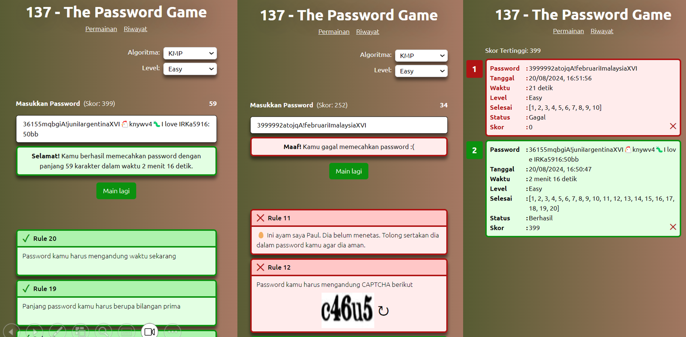

# Password Game
> Task 1 Seleksi Lab IRK - Ahmad Rafi Maliki 13522137

## Deskripsi

Aplikasi ini merupakan permainan Password Game menggunakan algoritma KMP dan BM serta pattern matching menggunakan Regex. Aplikasi ini dapat diakses pada [https://13522137-password-game.vercel.app/](https://13522137-password-game.vercel.app/). 

## Teknologi Yang Digunakan

### Bahasa Pemrograman:
1. HTML
2. CSS
3. JavaScript
   
### Front End
1. React
2. TailwindCSS

### Back End
1. Express

### Database
1. Google Cloud
   
### Deployment:
1. Vercel

## Struktur Program
```
fe/
├──src/ 
│    ├── node_modules/ 
│    ├── public/ 
│    ├── src/ 
│    │        ├── assets/ 
│    │        ├── class/ 
│    │        ├── components/ 
│    │        ├── logic/ 
│    │        ├── App.jsx 
│    │        ├── main.jsx 
│    │        ├── App.css
│    │        └── index.css 
│    ├── .gitignore 
│    ├── package.json 
│    ├── README.md 
│    └── vite.config.js
be/
└──index.js
```

## Algoritma

Algoritma yang saya gunakan adalah KMP dan juga BM, pengguna dapat memilih menggunakan algoritma yang mana. Saya menggunakan kedua algoritma ini karena kedua algoritma tersebut merupakan algoritma yang diajarkan di kelas, selain itu algoritma tersebut juga cukup efisien dalam mencari patten dalam sebuah teks. Untuk pattern yang tidak pasti dan hanya berupa pola seperti tahun khabisat, huruf kapital, dan angka romawi, saya menggunakan fitur regex matching dari bahasa pemrograman javascript.

## Cara menjalankan program
Aplikasi dapat diakses secara langsung pada [https://13522137-password-game.vercel.app/](https://13522137-password-game.vercel.app/)

1. Clone project dan install dependency
```
git clone https://github.com/rafimaliki/13522137-PasswordGame-Seleksi_IRK

# install dependency frontend
cd 13522137-QueensGame-Seleksi_IRK/src/fe
npm i

# install dependency backend
cd 13522137-QueensGame-Seleksi_IRK/src/be
npm i
```
2. Jalankan development server
```
# jalankan frontend
cd 13522137-QueensGame-Seleksi_IRK/src/fe
npm run dev

# jalankan backend
cd 13522137-QueensGame-Seleksi_IRK/src/be
node index.js
```
3. Akses frontend
```
http://localhost:5173/
```

## Tangkapan Layar



Gambar 1 ( kiri)
- Tangkapan layar halaman permainan saat berhasil memecahkan password <br>

Gambar 2 (tengah)
- Tangkapan layar halaman permainan saat gagal memecahkan password  <br>

Gambar 3 (kanan)
- Tangkapan layar halaman riwayat  <br>


## Referensi Belajar

[Website Rinaldi Munir](https://informatika.stei.itb.ac.id/~rinaldi.munir/Matdis/2023-2024/matdis23-24.htm) <br>
